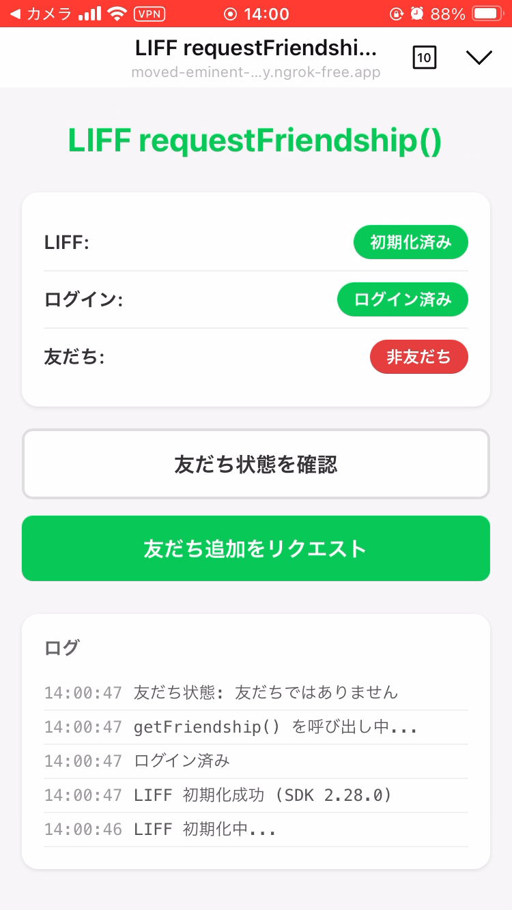

https://dev.classmethod.jp/articles/test-liff-request-friendship/

## UI



## 起動方法

```bash
cp .env.example .env
# .env編集
pnpm i

pnpm run dev

# スマホで確認するためにngrok起動
ngrok http --host-header=localhost:8000 --url=xxxxxx.ngrok-free.app https://localhost:9000
```

